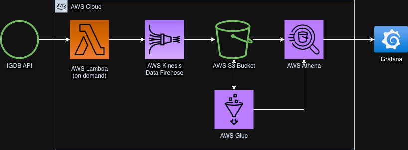
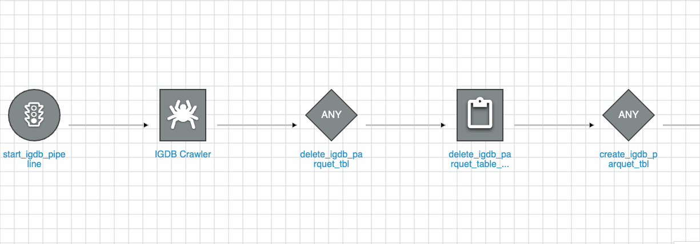
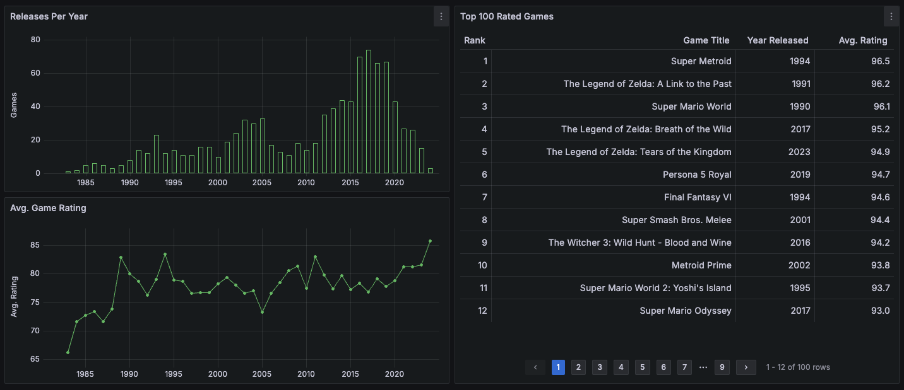

# Project IGDB: An Exploration of Learning ETL
**Author:** [Ehow Chen](https://github.com/ehowc)

**Last Updated:** December 15, 2024

## What is this project for?
This project is a demonstration of how to utilize cloud services to create a data engineering project from scratch. It is part of a guided course on Maven by [David Freitag](https://github.com/dkfreitag), which can be found [here](https://maven.com/david-freitag/first-serverless-de-project). The goals of creating this project include learning about various tools within Amazon Web Services (AWS), how they can be combined to create a compete workflow for extracting, transforming, and loading (ETL) data from online sources, and connect the transformed data to a tool for visualization. The process applied attempts to be as cost-effective and quick-to-query as possible so costs are contained with an increasing scale of data.

Perhaps more importantly, this project is about expanding my horizons and growing as a data professional. I aligned this project with my personal interests by learning how to use the [Internet Game Database (IGDB) API](https://www.igdb.com/api), as gaming is a lifelong hobby and passion of mine. This document doesn't dive deeply into the technical details or code, instead focusing on the broader picture of what is being used and why.

## Data Architecture 

The bulk of the this project uses AWS, with a bit of Python to process the data in a format that processes properly. Some of the tools are not necessary in principle given the "on demand" nature of the data collection, but they can be applied in robust settings like a live data stream.
* **Extract**: Lambda, Firehose, S3, Python, Athena
* **Transform**: S3, Athena, Glue
* **Load**: S3, Athena, Glue, Grafana

## API

This project uses data from the IGDB API, whose [site](https://www.igdb.com/api) clearly describes the steps to gaining access to the database. I found that using [Postman](https://www.postman.com/) helped me understand the nature of POST requests to use in the Python code.
* You are required to have a Twitch Developer account to generate credentials with IGDB using the POST request method.
* To narrow the scope of the query and analysis, the queries limited games to:
  * Nintendo platforms
  * Having at least 50 ratings from users and publications

The following fields were queried from the API:
* `id` (int): the unique ID of the game from IGDB
* `first_release_date` (timestamp): the date the game was initially released
* `name` (string): the name of the game
* `total_rating` (float): the average rating of the game across user and professional ratings
* `total_rating_count` (int): the total number of ratings
* `last_updated` (timestamp): code-generated timestamp when the code is run to call the API

## Extraction

Data extraction in a serverless environment is relatively straightforward. We need the following components:
* **Storage**: AWS S3 is our primary service to store data, as it is both cost effective and plays well with the rest of the AWS tools.
* **Collection**: Lambda utilizes Python code to call data from the IGDB API using Python. For the purposes of this project, we use Lambda to post requests in an "on demand" basis, but it can be scheduled to run on a regular basis using an Event Bridge.
* **Regulation**: Firehose enables us to collect data in situations where large amounts of data are constantly being called by Lambda and we wish to minimize computing costs to transfer the data. This particular tool is not necessary given the "on demand" nature of the project, but it is included for the sake of learning how to use it.
* **Inspection**: Athena allows us to use SQL to examine the data being received and create a database structure to it.

At a very high level, the process goes as follows.
1. An S3 bucket is created, dedicated to the data that is received.
2. A firehose is created, which points to the S3 bucket.
3. A process is written in Lambda using Python code to call the API and point the data to the firehose. The Python code used to call the API can be found [here](lambda/get_igdb_data_lambda.py).
4. Athena is used to verify the data within the S3 bucket. (A database and an S3 bucket need to be created to query.)

Because the IGDB API limits 500 results per query, the process above was run twice with different query parameters to gather about 1,000 data entries. Once the extracted data is verified to be as expected, we can move onto...

## Transformation

Data transformation in AWS can be approached many different ways, including third-party tools. This project uses Glue to minimize costs and simplify the flow, but tools like EC2 can be used for more complex processes.

Glue actually serves two purposes for Transformation:
1. Crawl the data to automate a data catalog for the extracted data from S3.
2. Write, update, and check a production table in a workflow using the crawled data.

Creating the crawler with Glue is relatively straightforward: you choose the S3 bucket with the extracted data and need to assign the Athena database. This enables Glue to automatically create a table to be referenced by the workflow.

The workflow allows us to accomplish to multiple goals:
1. Automate the creation of a production table.
2. Check the data quality.
3. Create the table in the parquet format, enabling efficient querying and cost savings.

Setting up the workflow is a little more complex compared to the previous steps of the ETL, requiring multiple Python scripts with triggers. This workflow is executed on demand much like the Lambda from earlier, but it can be set up to run at a regular cadence if the data is constantly updated. 

At a high level, the steps for setting up the Glue workflow are as follows:
1. Create a trigger to start the workflow. As mentioned, it is triggered on demand.
2. Connect the Glue crawler.
3. Create a trigger that is activated by the crawler.
4. Connect a Python script which deletes the parquet table, if it exists.
5. Create a trigger activated by the Python script from step 4.
6. Connect a Python script which creates a parquet table, referencing the table created by the crawler.
7. Create a trigger activated by the Python script from step 6.
8. Connect a Python script which checks for duplicate data in the parquet table. The workflow stops if it fails this data quality check.
9. Create a trigger activated by the Python script from step 8.
10. Connect a Python script which deletes the **production** parquet table, if it exists.
11. Create a trigger activated by the Python script from step 10.
12. Connect a Python script which creates a duplicate of the parquet table as a **production** table. This would be the table queried by a BI tool.

The Python scripts for the steps above can be found in [here](glue/).

After the workflow, we end up with a similar data structure as before with another enhancement.
* `id` (int): the unique ID of the game from IGDB
* `first_release_date` (timestamp): the date the game was initially released
* `name` (string): the name of the game
* `total_rating` (float): the average rating of the game across user and professional ratings
* `total_rating_count` (int): the total number of ratings
* `last_updated` (timestamp): code-generated timestamp when the code is run to call the API
* `release_year` (int): code-generated field based on `first_release_date`, which is used to partition the table for efficient queries

With the created production table formatted as a parquet and with a partitioned field, it is production ready for our imaginary stakeholders!

## Loading & Visualizing the Data

Practically any data visualization tool could be used for this step, but [Grafana](https://www.grafana.com/) is used here for its easy integration with Athena. After creating AWS credentials for Grafana to access our data, creating data visualzations for the IGDB data was relatively straightforward to demonstrate the results of the ETL. With a little under 1,000 games available, a few charts were created to demonstrate the usage of the data:
* Nintendo games released per year
* Average Nintendo game ratings per year
* Top 100 Nintendo Games by rating

[Link to Project IGBD's Grafana Snapshot](https://ehowconsults.grafana.net/dashboard/snapshot/2EuZOXr4pB4noHQbvUNC5LGuQNIpiUuf)

## Improvements

1. The scope was limited to a small subset of Nintendo games. A process could be written to extract all available entries in the IGDB DB over a period of time to populate the database. Given the natural constraint of 500 entries per query from the IGDB API, this could potentially be a costly upfront extraction.
2. The extraction could also include all the omitted fields.
3. IN addition, the process could extract tables that would add missing context to fields such as genre, platform, etc.
4. IGDB entries are updated on a weekly basis, which could be applied to the Lambda and Glue workflow as an automated process.
5. The workflow could be updated insert and update new entries instead of deleting and creating the table. This may be more efficient as the database grows in size.
6. Additional data quality checks can be added, such as flagging essential fields which are missing.
7. In a real world situation of the production table, there would be a small window in which they could not access it due to the workflow deleting it. The workflow could be updated to create the new production table, delete the old production, then rename the new production table to save some downtime.
